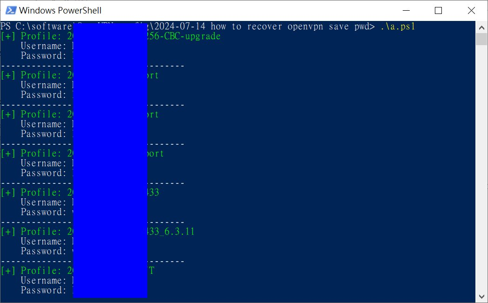

# OpenVPN_windows_saved_password
no user name saved, only password saved, user can ask admin to assign new one, or try to recover form local PC

ref:
https://github.com/flyinghuman/openvpnpasswordrecovery/tree/master

```
## ref, https://github.com/flyinghuman/openvpnpasswordrecovery/blob/master/openvpn-passwords.ps1
## modified, run on win10 powershell
## openvpn latest version, username is empty, not saved, only pwd saved


Add-Type -AssemblyName System.Security
Add-Type -AssemblyName System.Core
$keys = Get-ChildItem "HKCU:\Software\OpenVPN-GUI\configs"
$items = $keys | ForEach-Object {Get-ItemProperty $_.PsPath}

foreach ($item in $items)
{
    # Check if auth-data and entropy actually contain bytes
    if ($null -eq $item.'auth-data' -or $item.'auth-data'.Length -eq 0 -or $null -eq $item.'entropy' -or $item.'entropy'.Length -eq 0) {
        Write-Host "[-] Profile [$($item.PSChildName)] has no valid password data. Skipping." -ForegroundColor Yellow
        continue
    }

    $encryptedbytes = $item.'auth-data'
    $entropy = $item.'entropy'
    
    # Trim the trailing byte from entropy
    $entropy = $entropy[0..(($entropy.Length)-2)]

    try {
        # Attempt DPAPI Decryption
        $decryptedbytes = [System.Security.Cryptography.ProtectedData]::Unprotect(
            $encryptedBytes, 
            $entropy, 
            [System.Security.Cryptography.DataProtectionScope]::CurrentUser)
        
        # Safely handle username (fallback to "Not Saved" if the array is empty)
        $usernameStr = "Not Saved"
        if ($null -ne $item.username -and $item.username.Length -gt 0) {
            $usernameStr = [System.Text.Encoding]::Unicode.GetString($item.username)
        }
        
        $passwordStr = [System.Text.Encoding]::Unicode.GetString($decryptedbytes)

        Write-Host "[+] Profile: $($item.PSChildName)" -ForegroundColor Green
        Write-Host "    Username: $usernameStr"
        Write-Host "    Password: $passwordStr"
    }
    catch {
        Write-Host "[!] Failed to decrypt password for [$($item.PSChildName)]. Reason: $_" -ForegroundColor Red
    }
    
    Write-Host "------------------------------------"
}
```

   
